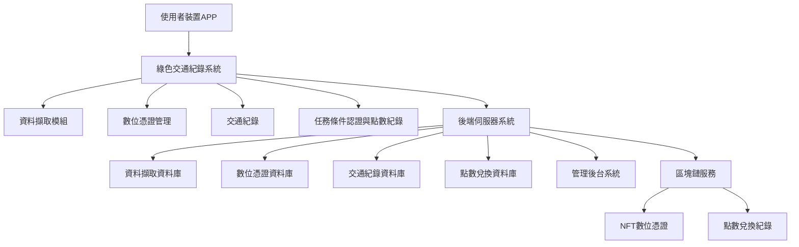
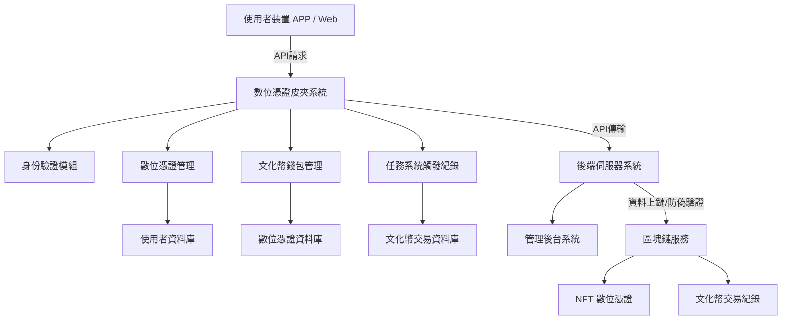

# 功能分解圖 (FDD)

```mermaid
graph TD
    A[使用者裝置APP] -->  B[綠色交通紀錄系統]
    B -->  C[資料擷取模組]
    B --> D[數位憑證管理]
    B --> E[交通紀錄]
    B --> F[任務條件認證與點數紀錄]
    B --> G[後端伺服器系統]
    G --> H[資料擷取資料庫]
    G --> I[數位憑證資料庫]
    G --> J[交通紀錄資料庫]
    G --> K[點數兌換資料庫]
    G --> L[管理後台系統]
    G --> M[區塊鏈服務]
    M --> N[NFT數位憑證]
    M --> O[點數兌換紀錄]

```

```mermaid
graph TD
    A[使用者裝置 APP / Web] -->|API請求| B[數位憑證皮夾系統]

    %% 數位憑證皮夾系統下的模組
    B --> C[身份驗證模組]
    B --> D[數位憑證管理]
    B --> E[文化幣錢包管理]
    B --> F[任務系統觸發紀錄]

    %% 對應的資料庫
    D --> D1[使用者資料庫]
    E --> E1[數位憑證資料庫]
    F --> F1[文化幣交易資料庫]

    %% 傳輸至後端伺服器系統
    B -->|API傳輸| G[後端伺服器系統]
    G --> G1[管理後台系統]

    %% 區塊鏈服務與其子項
    G -->|資料上鏈/防偽驗證| H[區塊鏈服務]
    H --> H1[NFT 數位憑證]
    H --> H2[文化幣交易紀錄]
```
